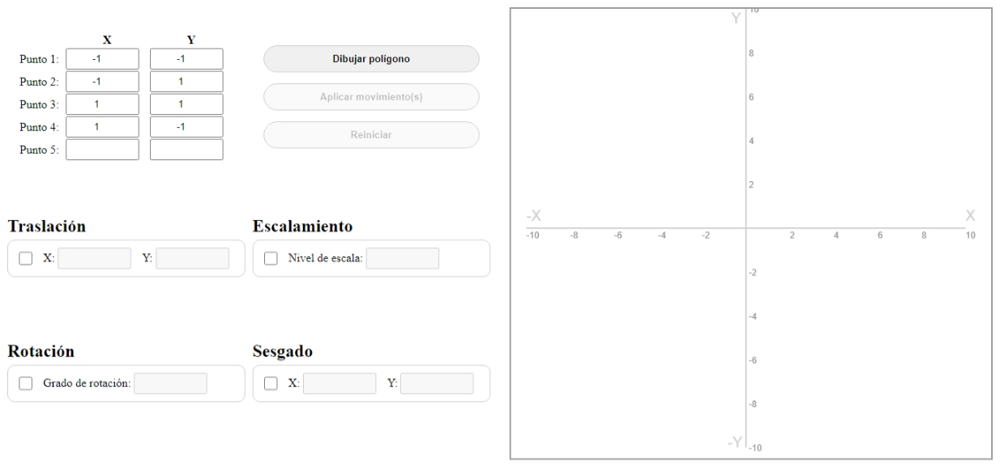

# Transformaciones 2D

## Descripción del problema

Desarrollar un programa que permita aplicar las tansformaciones bidimensionales **traslación, escalamiento, rotación y sesgado** cumpliendo los siguientes puntos:

1. El programa debera mostrar una interfaz grafica con un plano cartesiano, con rotulo de medidas.
2. Permitir ingresar los valores iniciales y dibujar el poligono.
3. Poder ingresar valores para las 4 transformaciones.
4. Aplicar cada transformación de manera individual.
5. Permitir aplicar 2, 3 o 4 transformaciones juntas al poligono inicial.

## Desarrollo de la solución

Para el desarrollo de la solución se utilizó el lenguaje de programación Javascript, con ayuda del elemento Canvas de HTML5, el cual permite dibujar gráficos en 2D y 3D. Complemetando con HTML y CSS para la interfaz gráfica.

### Interfaz gráfica

La interfaz gráfica se compone de un plano cartesiano, con rotulo de medidas, una tabla para ingresar los valores iniciales y campos de entrada para ingresar los valores de las transformaciones. Además, se cuenta con un botón para dibujar el polígono, uno para aplicar las transformaciones y otro para limpiar el plano.

## Ejecución del programa

Para ejecutar el programa se debe abrir el archivo `index.html` en un navegador web.